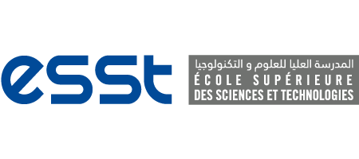
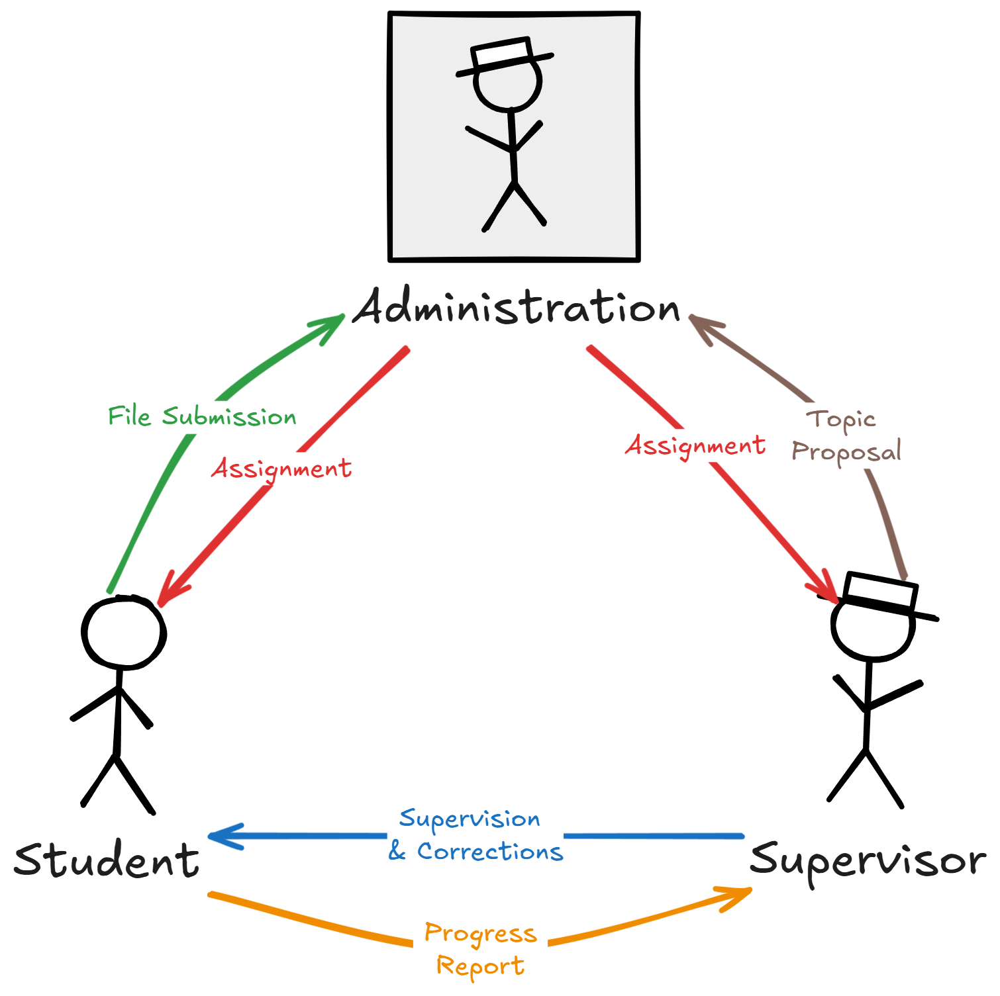
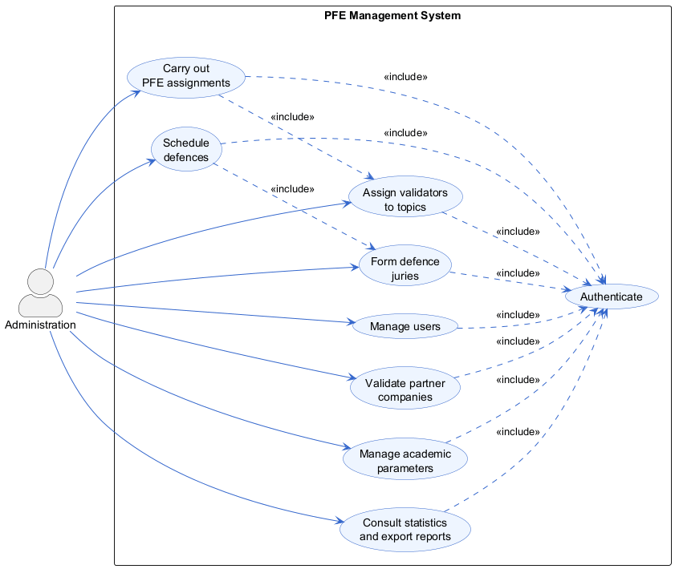
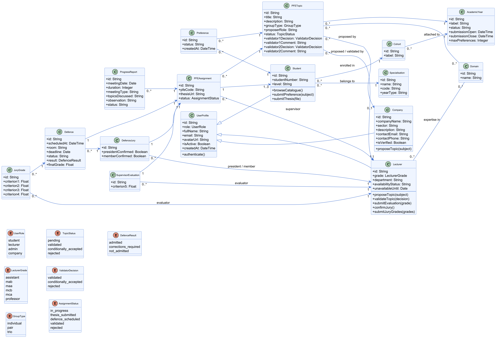
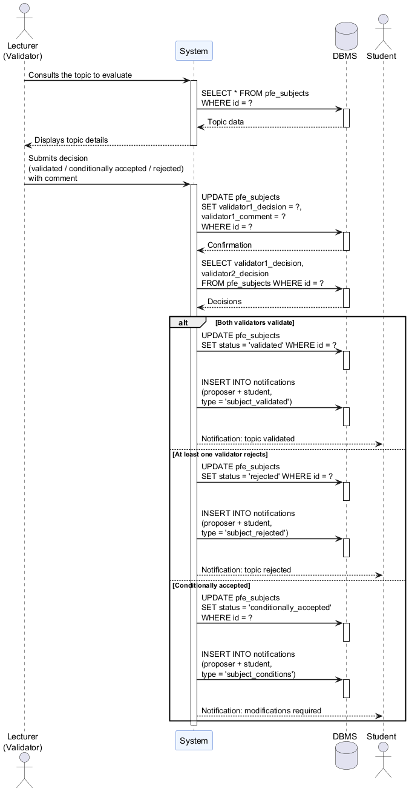
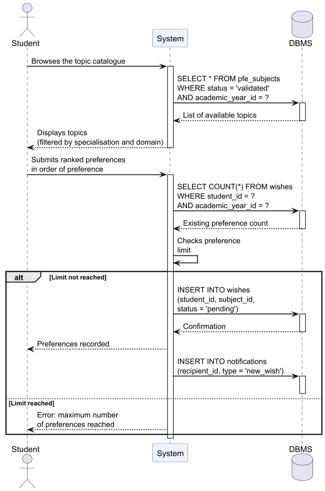
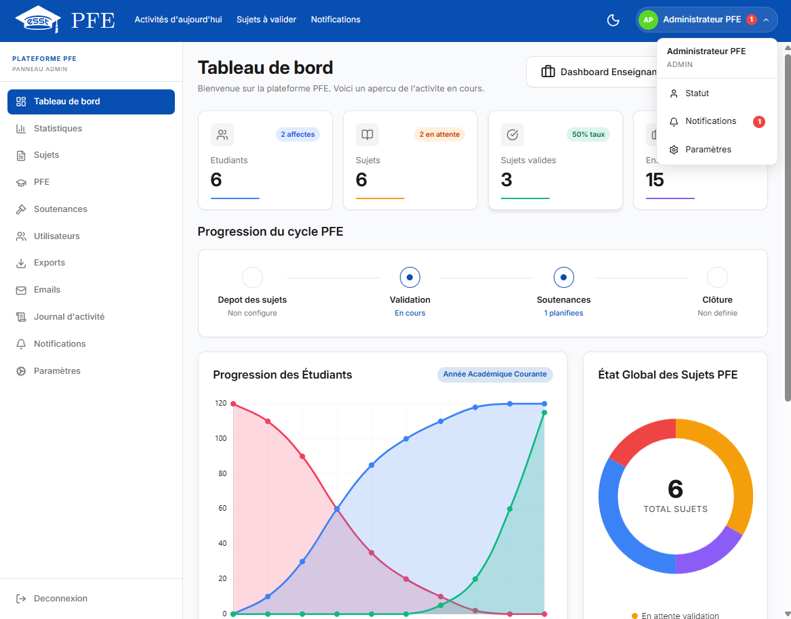
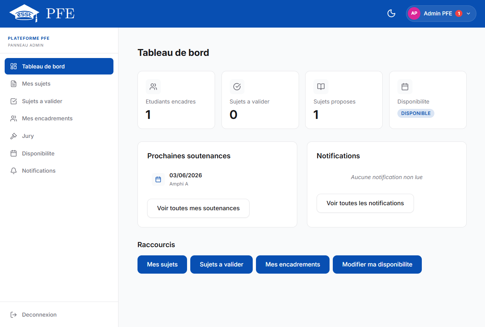
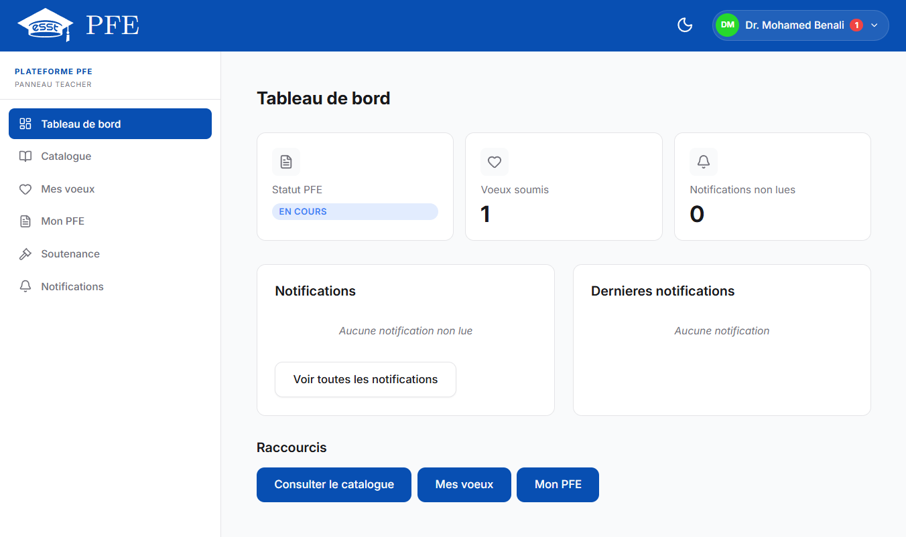
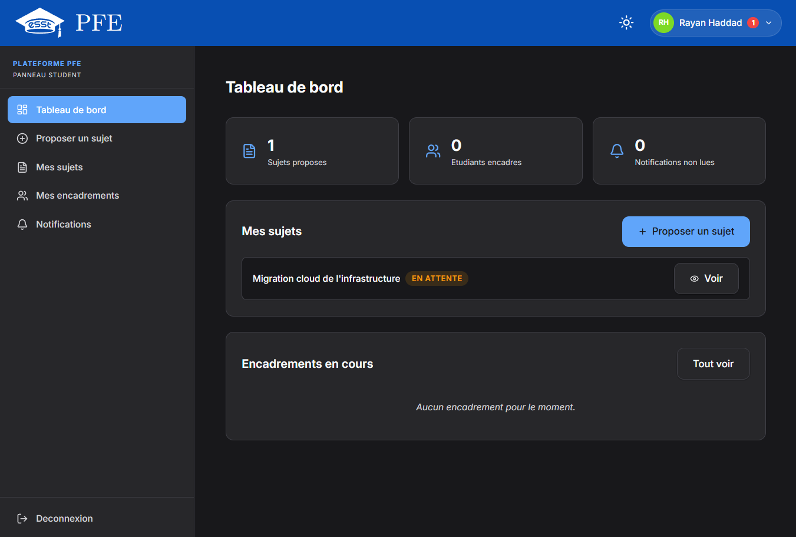

<!-- _class: title -->
<!-- _paginate: false -->
<!-- _header: '' -->
<!-- _footer: '' -->

# Système de Gestion des Projets de Fin d'Études (PFE)

## Application web dédiée au contexte universitaire algérien

**HADID Rami**
Encadré par : M. DERBAL | ESST d'Alger | 2025/2026

---

<!-- header: 'Plan de la présentation ' -->
<!-- footer: 'HADID Rami | Système de Gestion des PFE | ESST 2025/2026' -->

# Plan de la présentation

1. **Introduction et problématique**
2. **État de l'art et étude de l'existant**
3. **Conception du système**
4. **Réalisation et technologies**
5. **Démonstration**
6. **Conclusion et perspectives**

---

<!-- _class: divider -->
<!-- _paginate: false -->
<!-- _header: '' -->

# 1. Introduction et Problématique

Contexte, domaine et motivation du projet

---

<!-- header: 'Introduction et Problématique ' -->

# Contexte : le PFE en Algérie

- Le PFE est l'aboutissement **obligatoire** de tout cursus universitaire (Licence, Master, Ingénieur)
- L'étudiant mobilise ses compétences pour répondre à une problématique concrète
- Il donne lieu à un **mémoire** écrit et une **soutenance** devant jury
- Trois acteurs collaborent : **étudiant**, **enseignant**, **administration**
- Des **entreprises** partenaires peuvent également proposer des sujets externes

---

# Problématique

La gestion du PFE reste **manuelle et non structurée** dans les universités algériennes :

- Coordination par emails, tableurs Excel, échanges informels
- **Aucune plateforme unifiée** pour les différents acteurs
- Perte de documents, retards dans les affectations
- Difficulté de suivi pédagogique, absence de traçabilité
- Inégalités d'accès à l'information entre étudiants

> **Objectif** : concevoir et réaliser une application web dédiée couvrant l'intégralité du cycle de vie d'un PFE

---

<!-- _class: divider -->
<!-- _paginate: false -->
<!-- _header: '' -->

# 2. État de l'Art

Solutions existantes et étude de cas à l'ESST

---

<!-- header: 'État de l'Art ' -->

# Solutions existantes : les LMS

- **Moodle** : LMS open-source (400M+ utilisateurs), modules génériques
- **Canvas** : propriétaire, ~41% du marché nord-américain
- **Blackboard** : outils analytiques avancés, coût élevé

**Constat** : ces outils ne **modélisent pas le processus PFE** (proposition, validation, affectation, jury, notation)

| Critère                       | Moodle | Canvas | Blackboard | **Notre solution** |
| ----------------------------- | :----: | :----: | :--------: | :------------: |
| Proposition de sujets         |   ~    |   X    |     X      |     **V**      |
| Affectation automatisée       |   X    |   X    |     X      |     **V**      |
| Adapté au contexte algérien   |   X    |   X    |     X      |     **V**      |
| Déploiement simple            | Moyen  | Difficile | Difficile | **Simple**  |

---

# Étude de cas : l'ESST d'Alger

- Aucun catalogue centralisé de sujets disponibles
- Recherche de sujet par **bouche-à-oreille** (inégalités d'accès)
- Formalisation par **fiches papier** signées et déposées
- Validation **séquentielle** par 2 enseignants (email + papier)
- Suivi des affectations dans des **tableaux Excel**
- Planification des soutenances par **affichage / email collectif**

> **4 axes de dysfonctionnement** : manque de centralisation, absence d'automatisation, faible traçabilité, inégalités d'accès

---

<!-- _class: divider -->
<!-- _paginate: false -->
<!-- _header: '' -->

# 3. Conception du Système

Besoins fonctionnels et modélisation UML *(cf. Chapitre III du mémoire)*

---

<!-- header: 'Conception du Système ' -->

# Acteurs et besoins fonctionnels

**Étudiant**
- Consulter le catalogue de sujets
- Exprimer des vœux (classement)
- Suivre son PFE, déposer le mémoire
- Consulter ses résultats

**Enseignant**
- Proposer et valider des sujets
- Encadrer et suivre les étudiants
- Participer aux jurys et noter

**Administration**
- Gérer les utilisateurs
- Assigner les validateurs
- Affecter les PFE, constituer les jurys
- Planifier les soutenances
- Consulter les statistiques

**Entreprise**
- Proposer des sujets externes
- Gérer les candidatures
- Participer au suivi

---

# Cas d'utilisation de l'administration

Diagramme complet disponible à la page 28 du mémoire

---

# Diagramme de classes

Disponible en pleine page à la page 31 du mémoire

---

# Diagrammes de séquence

Validation d'un sujet (gauche) — Vœux et affectation (droite) — Pages 34-35 du mémoire

---

<!-- _class: divider -->
<!-- _paginate: false -->
<!-- _header: '' -->

# 4. Réalisation et Technologies

Choix techniques et architecture

---

<!-- header: 'Réalisation et Technologies ' -->

# Stack technique

**Frontend**
- **SvelteKit** (Svelte + Node.js)
- TypeScript (typage statique)
- HTML5 / CSS3 / SSR

**Base de données**
- **SQLite** (embarquée, ACID)
- Zéro configuration serveur

**Backend**
- **Go (Golang)** + **Fiber**
- API REST sécurisée
- Binaire autonome, zéro dépendances

**Architecture backend**
- Pattern **Repository-Service-Handler**
- Séparation stricte des responsabilités

---

# Justification des choix

- **SvelteKit** vs React/Vue : compilation sans runtime virtuel, performance supérieure
- **Go/Fiber** vs Node.js : binaire autonome, empreinte mémoire faible, déploiement simplifié
- **SQLite** vs PostgreSQL : zéro configuration, idéal pour la charge universitaire
- **Application web** : accessible partout, multi-plateforme, déploiement centralisé

---

<!-- _class: divider -->
<!-- _paginate: false -->
<!-- _header: '' -->

# 5. Démonstration

Interfaces principales de l'application

---

<!-- header: 'Démonstration ' -->

# Tableaux de bord

Administration (gauche) — Enseignant (droite)

---

# Tableaux de bord

Étudiant (gauche) — Entreprise (droite)

---

<!-- _class: divider -->
<!-- _paginate: false -->
<!-- _header: '' -->

# 6. Conclusion et Perspectives

---

<!-- header: 'Conclusion et Perspectives ' -->

# Synthèse

- **Problème** : gestion manuelle et non structurée des PFE
- **Solution** : application web dédiée couvrant tout le cycle PFE
- **Technologies** : SvelteKit + Go/Fiber + SQLite
- **Résultat** : plateforme fonctionnelle avec interfaces adaptées aux 4 acteurs

**Fonctionnalités couvertes** : proposition de sujets, validation, expression de vœux, affectation, suivi pédagogique, dépôt du mémoire, constitution des jurys, planification des soutenances, notation et résultats

---

# Perspectives

- **Notifications en temps réel** (WebSockets) pour alerter instantanément
- **Génération automatique de documents** : PV de soutenance, attestations
- **Module d'analyse statistique avancée** pour le pilotage décisionnel
- **Architecture multi-tenant** pour déployer sur plusieurs établissements
- **Application mobile** complémentaire pour le suivi en mobilité
- **Intégration avec les SI universitaires** existants (Progres, etc.)

---

<!-- _class: title -->
<!-- _paginate: false -->
<!-- _header: '' -->
<!-- _footer: '' -->

# Merci pour votre attention

## Questions ?
