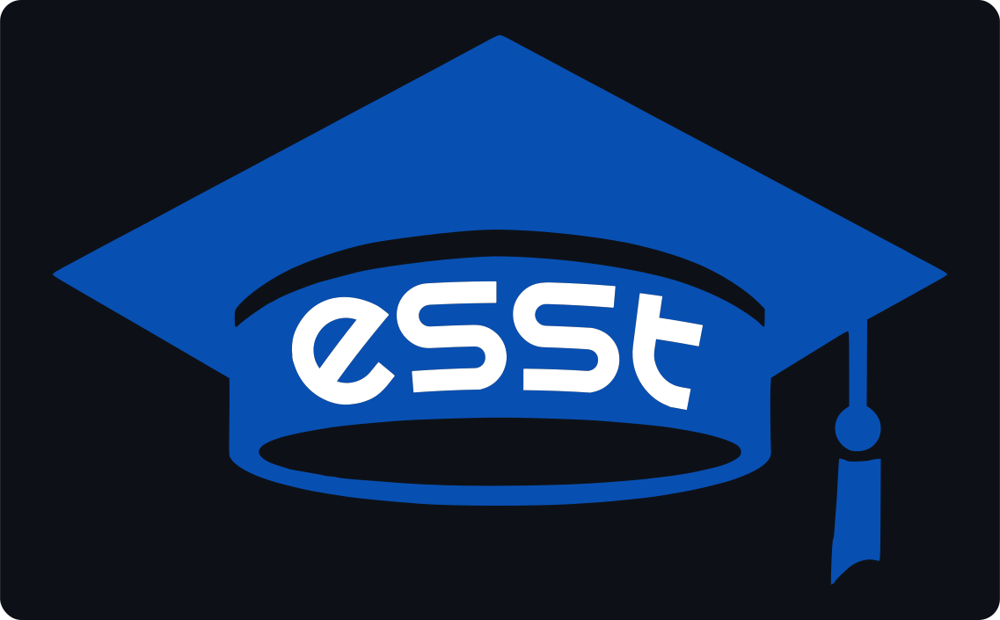
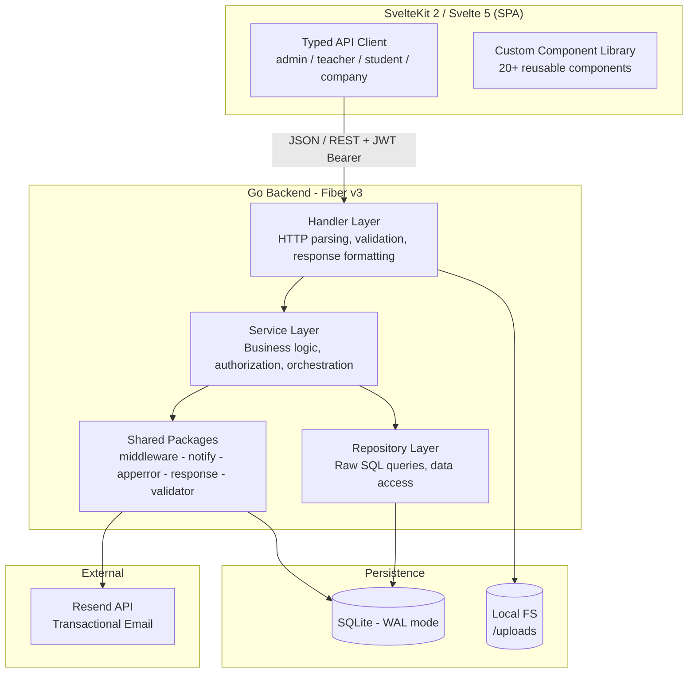
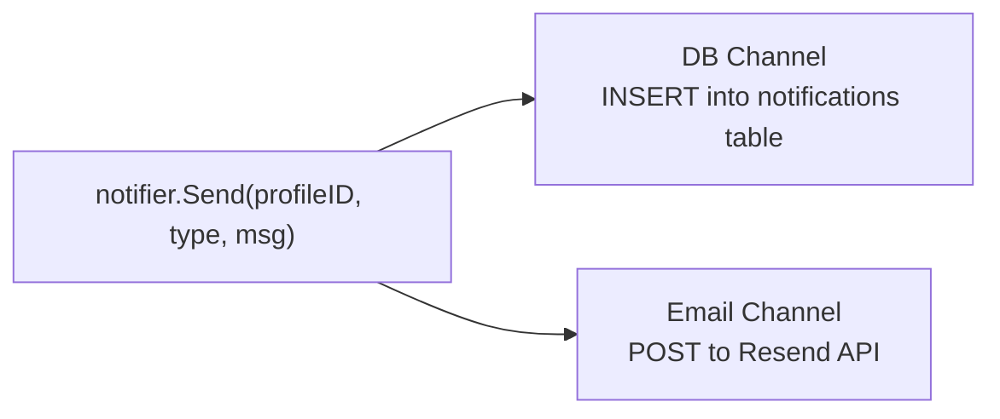

<div align="center">

  

  <h1>PFELMS</h1>
  <p><strong>Academic Project Management Platform</strong></p>

  <p align="center">
    A full-stack platform for managing the lifecycle of university graduation projects (PFE), built with <strong>Go</strong>, <strong>Fiber v3</strong>, <strong>SQLite</strong>, and <strong>SvelteKit 5</strong>.
  </p>

  <p>
    <a href="https://github.com/rhpo/lms/issues">Report Bug</a>
    &middot;
    <a href="https://github.com/rhpo/lms/issues">Request Feature</a>
  </p>

  <br>

  &nbsp;&nbsp;&nbsp;
  &nbsp;&nbsp;&nbsp;
  &nbsp;&nbsp;&nbsp;
  

  
  
  
  
  
  

</div>

---

<details>
  <summary><strong>Table of Contents</strong></summary>
  <ol>
    <li><a href="#overview">Overview</a></li>
    <li><a href="#architecture">Architecture</a></li>
    <li><a href="#backend">Backend</a></li>
    <li><a href="#frontend">Frontend</a></li>
    <li><a href="#getting-started">Getting Started</a></li>
    <li><a href="#project-structure">Project Structure</a></li>
    <li><a href="#api-surface">API Surface</a></li>
    <li><a href="#license">License</a></li>
  </ol>
</details>

<br>

<h2 id="overview">Overview</h2>

PFE-LMS is a multi-role academic platform with four distinct dashboards (admin, teacher, student, company), 60+ REST endpoints, a dual-channel notification system, and a custom SvelteKit component library. The backend is written entirely in Go with hand-written SQL (zero ORM) and the frontend uses Svelte 5 runes with a typed API client layer.

<br>

<h2 id="architecture">Architecture</h2>



### Layered Architecture

Every request flows through three strict layers. No layer may skip another.

| Layer | Responsibility | Location |
|-------|---------------|----------|
| **Handler** | Parse HTTP input, validate request shape, format JSON responses | `internal/handler/` |
| **Service** | Business rules, authorization checks, cross-entity orchestration | `internal/service/` |
| **Repository** | Execute SQL, scan rows into entities, return domain objects | `internal/repository/` |
| **Entity** | Pure data structs, 1:1 with database schema (Go struct tags match JSON) | `internal/entity/` |
| **Shared** | Cross-cutting concerns used by any layer | `internal/shared/` |

### Shared Packages

| Package | Purpose |
|---------|---------|
| `middleware` | JWT authentication, role-based route guards |
| `notify` | Dual-channel notification fan-out (DB + Email) |
| `apperror` | Typed application errors (BadRequest, NotFound, Forbidden) that map to HTTP status codes |
| `response` | Standardized `{ success, data, error }` JSON envelope |
| `validator` | Input validation helpers |
| `pfe_code` | Deterministic PFE code generator |

<br>

<h2 id="backend">Backend</h2>

### Stack

| | Technology |
|-|-----------|
| Language | **Go 1.23** |
| Router | **Fiber v3** (built on fasthttp) |
| Database | **SQLite** with WAL mode, single file, auto-migrating schema |
| Auth | **JWT HS256**, middleware-enforced, role-aware guards |
| Email | **Resend API**, conditionally enabled |
| Storage | Local filesystem for PDF uploads (thesis documents, avatars) |
| SQL | **Hand-written**, zero ORM, one repository per entity |

### Dual-Channel Notifications



Both channels fire on every `Send()` call. The email channel is only registered when a valid Resend API key is configured, so the system gracefully degrades to in-app-only notifications in development. `NotifyAdmins()` resolves all admin profile IDs internally and fans out.

### Entity ID Model

The system maintains a deliberate separation between **auth identity** and **domain identity**:

- `profiles.id` is the authentication identity (used by JWT, middleware)
- `teachers.id` / `students.id` are domain entity IDs (used by foreign keys in `defense_juries`, `jury_grades`, etc.)

The service layer resolves between them via `resolveTeacherID(profileID)`, keeping handlers and repositories free of this concern.

### Nullable Types

Custom `NullString` and `NullFloat64` wrappers around `database/sql` null types that implement `json.Marshaler` / `json.Unmarshaler`. This means nullable database columns serialize cleanly to JSON (`null` instead of `{"Valid": false, "String": ""}`) without any manual mapping in handlers.

### Migration Strategy

Schema migrations are embedded directly in `cmd/server/main.go` as idempotent `ALTER TABLE` statements executed on startup. No migration framework, no version tracking table. Each statement uses SQLite's `ALTER TABLE ... ADD COLUMN` which is a no-op if the column already exists.

<br>

<h2 id="frontend">Frontend</h2>

### Stack

| | Technology |
|-|-----------|
| Framework | **SvelteKit 2** (SSR disabled, SPA mode) |
| Reactivity | **Svelte 5 Runes** (`$state`, `$derived`, `$effect`, `$props`) |
| Icons | **Lucide Svelte** |
| Charts | **Chart.js** |
| Styling | Scoped CSS with design tokens via custom properties |

### Typed API Client

A single `api.ts` module exports four role-scoped objects, each providing typed methods that map 1:1 to backend endpoints:

```typescript
export const admin = {
  listSubjects:    () => get<PfeSubject[]>('/admin/subjects'),
  submitGrade:     (id, body) => post<{message: string}>(`/admin/defenses/${id}/submit-grade`, body),
  // ...30+ methods
};

export const teacher = { /* 15+ methods */ };
export const student = { /* 10+ methods */ };
export const company = { /* 5+ methods  */ };
```

All methods go through a single `request<T>()` wrapper that handles JWT injection, error unwrapping, and response typing. The frontend `types/domain.ts` mirrors Go entities field-for-field.

### Component Library

20+ reusable UI components built from scratch (no external UI framework):

`AppShell` / `Avatar` / `Badge` / `Button` / `Calendar` / `DateInput` / `FormField` / `Modal` / `Notification` / `Page` / `Pagination` / `SearchInput` / `Select` / `Switch` / `Table` / `Tabs` / `ThemeToggle` / `Tooltip`

### Route Structure

Four isolated dashboard layouts, each with its own `+layout.svelte` and auth guard:

```
(dashboard)/
  admin/       -> 15+ pages (subjects, PFEs, defenses, users, settings, audit...)
  teacher/     -> 8 sections (proposed subjects, validation, supervision, jury duties...)
  student/     -> 9 sections (catalogue, wishes, my PFE, progress, defense, grades...)
  company/     -> partner portal (subjects, PFE tracking)
```

<br>

<h2 id="getting-started">Getting Started</h2>

### Prerequisites

- **Go** 1.23+
- **Node.js** 20+ and **pnpm**
- (Optional) **Resend** API key for email delivery

### Run

```bash
git clone https://github.com/rhpo/lms.git
cd lms

# Backend
cd backend
go mod download
cp .env.example .env       # set JWT_SECRET, RESEND_API_KEY, etc.
go run cmd/server/main.go   # starts on :8080

# Frontend
cd ..
pnpm install
pnpm dev                    # starts on :5173, proxies API to backend
```

### Environment

| Variable | Description | Required |
|----------|------------|----------|
| `JWT_SECRET` | HMAC key for signing tokens | Yes |
| `RESEND_API_KEY` | Resend key for email notifications | No |
| `DB_PATH` | SQLite file path | No (defaults to `./pfe.db`) |
| `PORT` | Backend listen port | No (defaults to `8080`) |

<br>

<h2 id="project-structure">Project Structure</h2>

```
lms/
|
+-- backend/
|   +-- cmd/server/main.go            # Entrypoint, route registration, migrations
|   +-- internal/
|   |   +-- config/                    # Environment and app config
|   |   +-- entity/                    # Domain structs (1:1 with DB rows)
|   |   +-- handler/                   # HTTP handlers per role
|   |   +-- repository/                # One repo per entity, raw SQL
|   |   +-- service/                   # Business logic per role
|   |   +-- shared/
|   |       +-- apperror/              # Typed errors -> HTTP status
|   |       +-- middleware/             # JWT auth + role guards
|   |       +-- notify/                # DB + Email notification channels
|   |       +-- pfe_code/              # PFE code generator
|   |       +-- response/              # JSON response envelope
|   |       +-- validator/             # Input validation
|   +-- tests/                         # Integration tests
|   +-- uploads/                       # Stored files (PDFs, avatars)
|
+-- src/
|   +-- lib/
|   |   +-- api.ts                     # Typed REST client (admin/teacher/student/company)
|   |   +-- components/ui/             # 20+ custom components
|   |   +-- stores/                    # Auth and theme stores
|   |   +-- types/domain.ts            # TypeScript types mirroring Go entities
|   +-- routes/
|       +-- (app)/                     # Public pages (landing, login)
|       +-- (dashboard)/               # Role-scoped dashboards
|
+-- static/                            # Fonts, media, icons
+-- svelte.config.js
+-- vite.config.ts
```

<br>

<h2 id="api-surface">API Surface</h2>

<details>
<summary><strong>Admin</strong> (30+ endpoints)</summary>

| Method | Endpoint | Description |
|--------|----------|-------------|
| `GET` | `/api/admin/dashboard` | Dashboard statistics |
| `GET` | `/api/admin/subjects` | List all subjects |
| `POST` | `/api/admin/subjects/:id/assign-validators` | Assign peer reviewers |
| `GET` | `/api/admin/pfes` | List PFE assignments |
| `POST` | `/api/admin/pfes/:id/co-supervisor` | Assign co-supervisor |
| `POST` | `/api/admin/defenses` | Schedule a defense |
| `GET` | `/api/admin/defenses/recommend-jury` | Domain-based jury recommendations |
| `POST` | `/api/admin/defenses/:id/resolve-grade` | Resolve final grade |
| `GET` | `/api/admin/settings/deadlines` | Academic year settings |
| `GET` | `/api/admin/audit-log` | Audit trail |

</details>

<details>
<summary><strong>Teacher</strong> (15+ endpoints)</summary>

| Method | Endpoint | Description |
|--------|----------|-------------|
| `GET` | `/api/teacher/dashboard` | Dashboard |
| `GET` | `/api/teacher/proposed-subjects` | My proposed subjects |
| `GET` | `/api/teacher/subjects-to-validate` | Pending reviews |
| `POST` | `/api/teacher/subjects-to-validate/:id/validate` | Submit review |
| `GET` | `/api/teacher/supervised-pfes` | Supervised PFEs |
| `POST` | `/api/teacher/supervised-pfes/:id/evaluation` | Submit evaluation |
| `GET` | `/api/teacher/jury-duties` | Jury assignments |
| `GET` | `/api/teacher/jury-duties/:id/grade-context` | Grading context |
| `POST` | `/api/teacher/jury-duties/:id/grade` | Submit member grade |
| `POST` | `/api/teacher/jury-duties/:id/final-grade` | Finalize grade (president) |

</details>

<details>
<summary><strong>Student</strong> (10+ endpoints)</summary>

| Method | Endpoint | Description |
|--------|----------|-------------|
| `GET` | `/api/student/dashboard` | Dashboard |
| `GET` | `/api/student/catalogue` | Browse subjects |
| `POST` | `/api/student/voeux` | Submit wish |
| `GET` | `/api/student/my-pfe` | My assignment |
| `POST` | `/api/student/my-pfe/memoire` | Upload thesis |
| `GET` | `/api/student/soutenance` | Defense info and grades |

</details>

<details>
<summary><strong>Company</strong></summary>

| Method | Endpoint | Description |
|--------|----------|-------------|
| `GET` | `/api/company/dashboard` | Dashboard |
| `POST` | `/api/company/subjects` | Propose subject |
| `GET` | `/api/company/pfes` | Track PFEs |

</details>

<br>

<h2 id="license">License</h2>

MIT License. See `LICENSE` for details.

<br>

---

<div align="center">
  <sub>Built by <a href="mailto:ramy.hadid@esst-sup.com">Ramy Hadid</a></sub>
</div>
